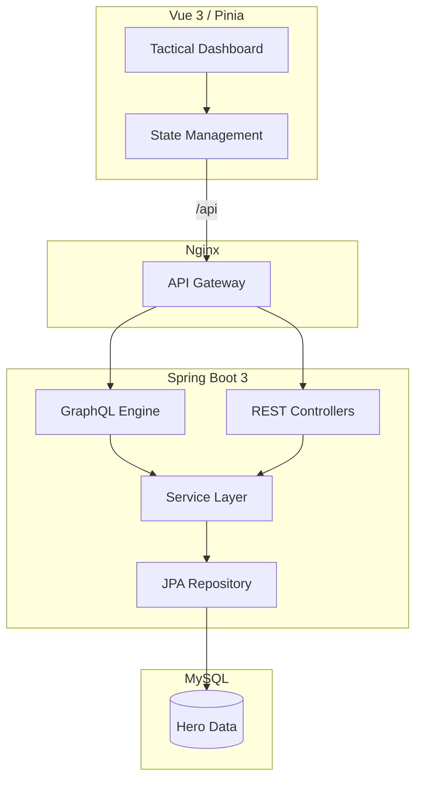

# HeroSync: The Ultimate Gamified Productivity Engine


HeroSync is a **Full-Stack Gamification Ecosystem** designed to bridge the gap between real-world productivity and RPG engagement. Built with a robust **Spring Boot 3** backend and a reactive **Vue 3** frontend, HeroSync transforms daily habits into epic quests and challenges.

<p align="center">
  
</p>

## ✦ Overview
HeroSync allows users to track their habits, set ambitious goals, and face "Boss Battles" that represent their most significant challenges. By completing tasks, users earn Experience Points (XP), level up their hero, and unlock achievements that celebrate their consistency.

## ⚡ Key Features
- **Universal Theme Engine**: Seamless toggle between **Cinema Dark** and **Crystal Light** modes with persistent state management.
- **Dynamic Habit Tracking**: Monitor your daily routines with interactive heatmaps, progress bars, and real-time XP bursts.
- **Goal System & Boss Battles**: Set goals linked to habits. Mark high-priority goals as "Bosses" for greater rewards and a more challenging visual experience.
- **Achievement Vault**: Unlock unique badges based on your performance, streaks, and milestones.
- **Hero Profile**: Customize your 3D avatar (via Avaturn) and watch your hero grow as you gain XP.
- **Production-Ready Docker Pipeline**: Pre-configured Nginx reverse proxy and containerized microservices for instant, secure VPS deployment.

## ⚙ Tech Stack

| Layer | Technologies |
| :--- | :--- |
| **Frontend** |    |
| **Backend** |    |
| **Database** |   |
| **Security** |   |
| **DevOps** |   |

## 💠 Architecture
HeroSync follows a **Modular Monolith** pattern with a clean separation of concerns:
- **GraphQL Engine**: For complex, nested data retrieval (Dashboard, Reports).
- **RESTful API**: For standard operations and authentication.
- **Service Layer**: Centralized business logic (XP calculation, Achievement unlocking).
- **Reverse Proxy**: Nginx handles SSL termination and API routing to prevent CORS issues.



## 🚀 Quick Start (Recommended)
The fastest way to get HeroSync running is using **Docker**. You don't need to install Java, Node, or MySQL on your host machine.

1. Clone the repo.
2. Run:
   ```bash
   docker compose up -d
   ```
3. Access the dashboard at `http://localhost:80`.

## 🛠️ Manual Development Setup
If you want to modify the code and see changes in real-time without Docker:

#### Prerequisites
- **Java 21**+
- **Node.js 18**+
- **MySQL 8.0**

#### Local Development
1. **Backend**: Navigate to `HeroSync/backend` and run `./mvnw spring-boot:run`.
2. **Frontend**: Navigate to `HeroSync/frontend/frontend-ui`, run `npm install` then `npm run dev`.
3. **Access**: `http://localhost:5173`.

## ⎔ Documentation
Detailed documentation, including the [UML Class Diagram](./Wiki/docs/UML-Class-diagram.md) and [Assignment Breakdown](./Wiki/docs/Assignment-Breakdown.md), can be found in the `/Wiki` directory.

---
*Developed with a focus on Performance, Professional Integrity, and Epic Engagement.*

