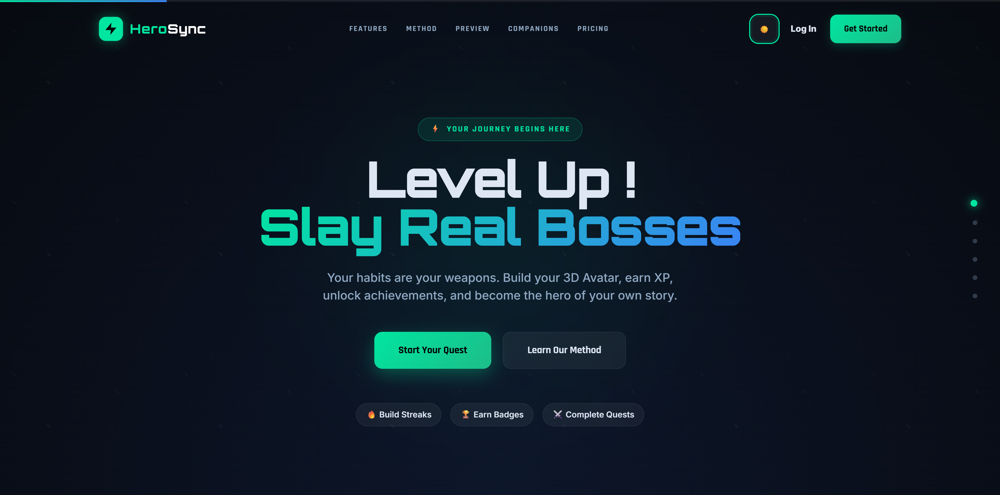
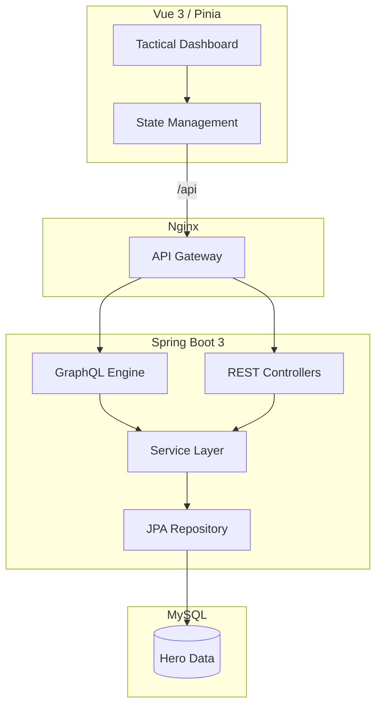

# HeroSync: The Ultimate Gamified Productivity Engine

[](https://github.com/Yug-Dave/HeroSync/actions)
[](#-tech-stack)
[](./LICENSE)
[](http://89.168.119.240/)

HeroSync is a **Full-Stack Gamification Ecosystem** designed to bridge the gap between real-world productivity and RPG engagement. Built with a robust **Spring Boot 3** backend and a reactive **Vue 3** frontend, HeroSync transforms daily habits into epic quests and challenges.

<p align="center">
  
</p>

## ✦ Overview
HeroSync allows users to track their habits, set ambitious goals, and face "Boss Battles" that represent their most significant challenges. By completing tasks, users earn Experience Points (XP), level up their hero, and unlock achievements that celebrate their consistency.

## ✦ Key Features
- **Universal Theme Engine**: Seamless toggle between **Cinema Dark** and **Crystal Light** modes with persistent state management.
- **Dynamic Habit Tracking**: Monitor your daily routines with interactive heatmaps, progress bars, and real-time XP bursts.
- **Goal System & Boss Battles**: Set goals linked to habits. Mark high-priority goals as "Bosses" for greater rewards and a more challenging visual experience.
- **Achievement Vault**: Unlock unique badges based on your performance, streaks, and milestones.
- **Hero Profile**: Customize your 3D avatar (via Avaturn) and watch your hero grow as you gain XP.
<<<<<<< HEAD
- **HeroMode AI**: Multi-model AI companion (Gemini, OpenAI, Groq) offering personalized quest advice and dynamic motivation.
- **Production-Ready Docker Pipeline**: Pre-configured Nginx reverse proxy and containerized microservices for instant, secure VPS deployment.
=======
- **Production-Ready Docker Pipeline**: Pre-configured Nginx reverse proxy and containerized microservices for instant, secure VPS deployment.

>>>>>>> origin/main
## ⚙ Tech Stack

| Layer | Technologies |
| :--- | :--- |
| **Frontend** |    |
| **Backend** |    |
| **Database** |   |
| **Security** |   |
| **DevOps** |   |

## ◈ Architecture
HeroSync follows a **Modular Monolith** pattern with a clean separation of concerns:
- **GraphQL Engine**: For complex, nested data retrieval (Dashboard, Reports).
- **RESTful API**: For standard operations and authentication.
- **Service Layer**: Centralized business logic (XP calculation, Achievement unlocking).
- **Reverse Proxy**: Nginx handles SSL termination and API routing to prevent CORS issues.



## ⌬ Technical Excellence

### ◢ Advanced Architecture
HeroSync follows a **Modular Monolith** pattern with a clean separation of concerns:
- **Hybrid API Layer**: Combines the efficiency of **GraphQL** for complex, nested dashboard data with the simplicity of **REST** for standard CRUD operations.
- **Cinematic UI/UX**: Implemented a unified **Glassmorphic Design System** using native CSS variables and BEM methodology, ensuring 100% theme consistency without third-party styling overhead.
<<<<<<< HEAD
- **Context-Aware AI Integration**: Built a modular `AiProviderChoice` system to seamlessly toggle between multiple LLMs (Gemini, OpenAI, Groq), injecting live user context (XP, Habits, Streaks) for highly personalized companionship.
=======
>>>>>>> origin/main
- **3D Avatar Pipeline**: Successfully bridged 3D model state (Avaturn) with relational data, allowing for a personalized, persistent hero presence.

### ✦ Performance & Scalability
- **JVM Optimization**: Configured with optimized memory flags and SerialGC for high-performance execution on resource-constrained VPS environments.
- **Nginx Reverse Proxy**: Custom Nginx configuration handles SSL termination, static asset serving, and API routing, eliminating CORS issues and improving security.
- **Database Integrity**: Utilizes Spring Data JPA with custom Hibernate dialects to manage complex relationships and ensure atomic XP distributions.

## ⎔ Technical Challenges Solved

### 1. Atomic XP & Level Synchronization
**Challenge**: Ensuring data integrity during high-concurrency "Level-Up" events. Completing a task triggers multiple operations: logging activities, recalculating XP, checking achievements, and potentially triggering level-ups. A failure in any one would lead to inconsistent user states.
**Solution**: Orchestrated a robust transactional layer using **Spring's `@Transactional`** boundaries. Combined this with idempotent achievement generation (using unique composite keys) to ensure that XP gains and achievement unlocks are atomic and durable, even if multiple requests arrive simultaneously.

### 2. High-Density Glassmorphic Performance
**Challenge**: Maintaining a "Cinema-Grade" UI with heavy use of `backdrop-filter` and transparency without causing performance lag on mobile devices or during complex dashboard transitions.
**Solution**: Implemented a hardware-accelerated CSS strategy. Leveraged `will-change` properties to force GPU rendering for holographic elements and optimized the DOM structure by utilizing **CSS Grid** to minimize layout nesting. This maintained a consistent 60fps experience across both desktop and mobile viewports.

### 3. Dynamic Scalable Achievement Logic
**Challenge**: Preventing database bloat and performance degradation in the Dynamic Achievement System. As users level up, generating unique rewards for every milestone could lead to thousands of redundant rows and slow query times.
**Solution**: Developed a **Lazy Evaluation & Repair Pattern**. Instead of pre-generating thousands of badges, the system utilizes a lightweight "Generator" that uses pattern-matching logic to verify and sync achievements on-the-fly. This ensures the database remains lean while allowing the business logic (XP rewards per level) to evolve without breaking historical data.


## ➤ Quick Start (Easiest)
The fastest way to get HeroSync running is using **Docker**. This handles all the complex setup for you automatically.

1. **Open Docker**: Ensure **Docker Desktop** is open and running on your computer.
2. **Download**: Clone this repository to your machine.
3. **Launch**: Open a terminal in the project folder and run:
   ```bash
   docker compose up -d
   ```
4. **Access**: Open your browser and go to `http://localhost:80`.

---

## ⬢ Manual Setup (For Developers)
Use this method if you want to modify the code and see changes in real-time.

### 1. Prerequisites
You must have these installed on your machine:
- **Java 21**+
- **Node.js 18**+
- **MySQL 8.0**

### 2. Database Setup
1. **Create DB**: Open your MySQL terminal and run: `CREATE DATABASE HeroSync_db;`.
2. **Configure**: Open `./backend/src/main/resources/application.yaml`.
3. **Password**: Find line 19 (`password: ${DB_PASSWORD}`) and replace `${DB_PASSWORD}` with your actual MySQL password.

### 3. Start the Application
- **Backend**: In the `/backend` folder, run `./mvnw spring-boot:run`.
- **Frontend**: In `/frontend/frontend-ui`, run `npm install` and then `npm run dev`.
- **Access**: Open your browser to `http://localhost:5173`.

## ⎔ Documentation
Detailed documentation, including the [UML Class Diagram](./Wiki/docs/UML-Class-diagram.md) and [Assignment Breakdown](./Wiki/docs/Assignment-Breakdown.md), can be found in the `/Wiki` directory.

> [!NOTE]
> **Project Attribution**: HeroSync is a professional solo evolution of a university project originally developed as **Momentum** by team **GlitchGang** ([Original Repository](https://github.com/FrankV17/web2-ws25-GlitchGang)). As a core member of the original development team, I have extensively refactored and expanded the codebase into this production-ready platform.

---
*Developed with a focus on Performance, Professional Integrity, and Epic Engagement.*

