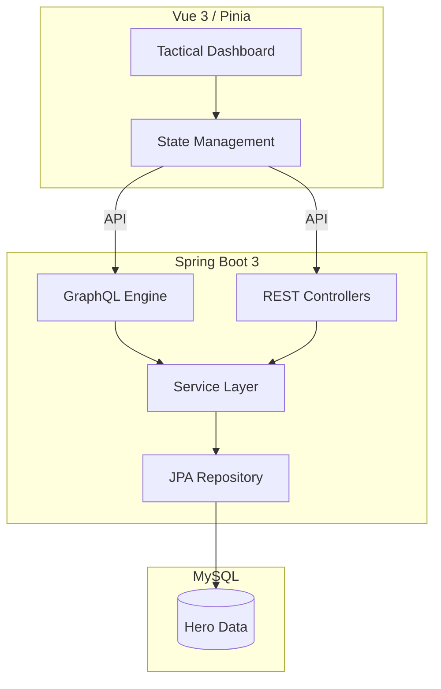

# HeroSync: The Ultimate Gamified Productivity Engine


HeroSync is a **Full-Stack Gamification Ecosystem** designed to bridge the gap between real-world productivity and RPG engagement. Built with a robust **Spring Boot 3** backend and a reactive **Vue 3** frontend, HeroSync transforms daily habits into epic quests and challenges.

## ✦ Overview
HeroSync allows users to track their habits, set ambitious goals, and face "Boss Battles" that represent their most significant challenges. By completing tasks, users earn Experience Points (XP), level up their hero, and unlock achievements that celebrate their consistency.

<p align="center">
  
</p>


## ⚡ Key Features
- **Dynamic Habit Tracking**: Monitor your daily routines with interactive heatmaps and progress bars.
- **Goal System & Boss Battles**: Set goals linked to habits. Mark high-priority goals as "Bosses" for greater rewards and a more challenging visual experience.
- **Achievement Vault**: Unlock unique badges based on your performance, streaks, and milestones.
- **Hero Profile**: Customize your 3D avatar (via Avaturn) and watch your hero grow as you gain XP.
- **Deep Analytics**: Weekly and monthly reports provide insights into your productivity patterns.

## ⚙ Tech Stack

| Layer | Technologies |
| :--- | :--- |
| **Frontend** |    |
| **Backend** |    |
| **Database** |   |
| **Security** |   |
| **Design** |   |

## 💠 Architecture
HeroSync follows a **Modular Monolith** pattern with a clean separation of concerns:
- **GraphQL Engine**: For complex, nested data retrieval (Dashboard, Reports).
- **RESTful API**: For standard operations and authentication.
- **Service Layer**: Centralized business logic (XP calculation, Achievement unlocking).
- **Security**: Robust session management and CSRF protection.



## ⎆ Getting Started

### Prerequisites
- **Java 21** or higher
- **Node.js 18** or higher
- **MySQL 8.0**
- **Docker** (Optional, for easy database setup)

### Backend Setup
1. Navigate to `HeroSync/backend`.
2. Configure your database in `src/main/resources/application.yaml` or set environment variables:
   - `DB_USERNAME`: your_username
   - `DB_PASSWORD`: your_password
3. Run the application:
   ```bash
   ./mvnw spring-boot:run
   ```

### Frontend Setup
1. Navigate to `HeroSync/frontend/frontend-ui`.
2. Install dependencies:
   ```bash
   npm install
   ```
3. Run the development server:
   ```bash
   npm run dev
   ```
4. Access the app at `http://localhost:5173`.

## ⎔ Documentation
Detailed documentation, including the [UML Class Diagram](./Wiki/docs/UML-Class-diagram.md) and [Assignment Breakdown](./Wiki/docs/Assignment-Breakdown.md), can be found in the `/Wiki` directory.

---
*Developed with a focus on Performance, Professional Integrity, and Epic Engagement.*
