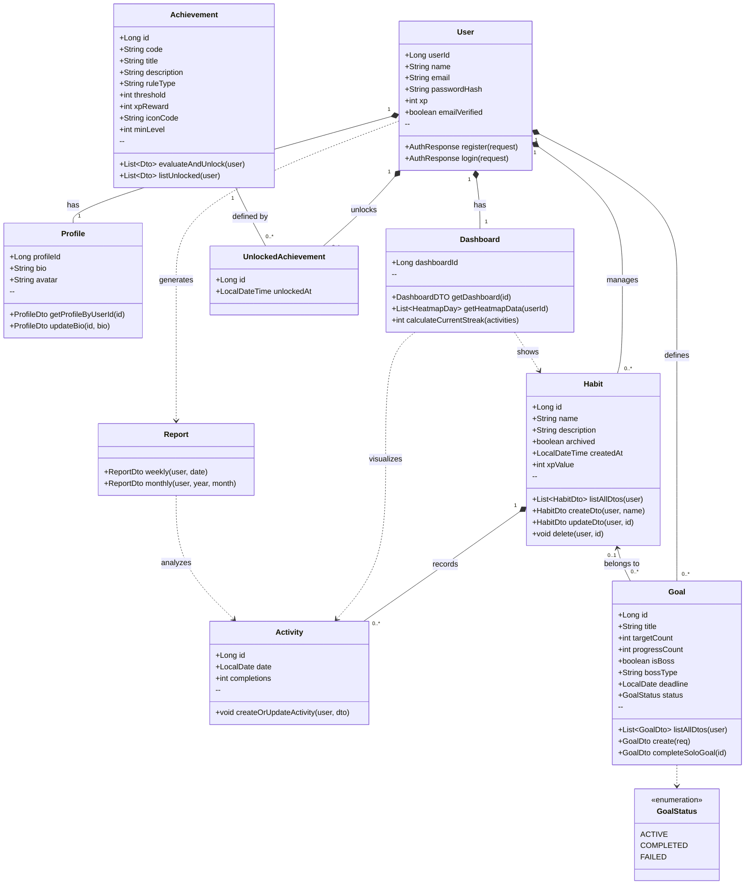

## UML Class Diagram
The following diagrams illustrate the structure of our application “HeroSync – The Habit Tracker.”
They describe the key classes, attributes, methods, and relationships between components.

---
